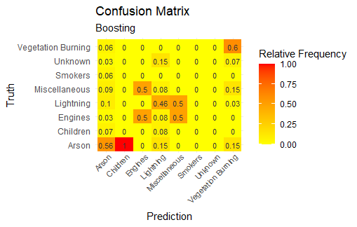
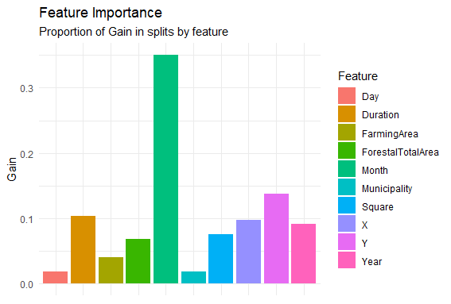

# Wildfires Classification

Project based on the application of distinct classification algorithms in order to determine the cause of wildfires.

## Models

+ LDA, with a previous PCA to train with the principal components
+ Tree Based Models: 
  + Random Forest
  + Boosting
  + XGBoosting
+ KNN

## Results 

**Boosting** has been the best performing model. The following images show the confusion matrix of the test set prediction, and the importance of the model's features for the best model.

 

